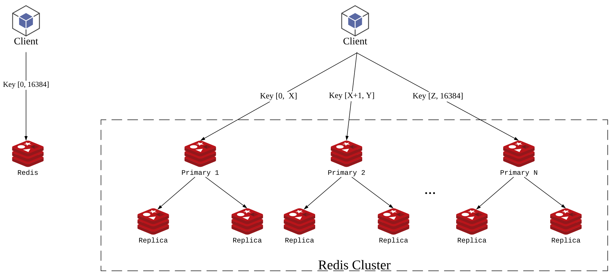
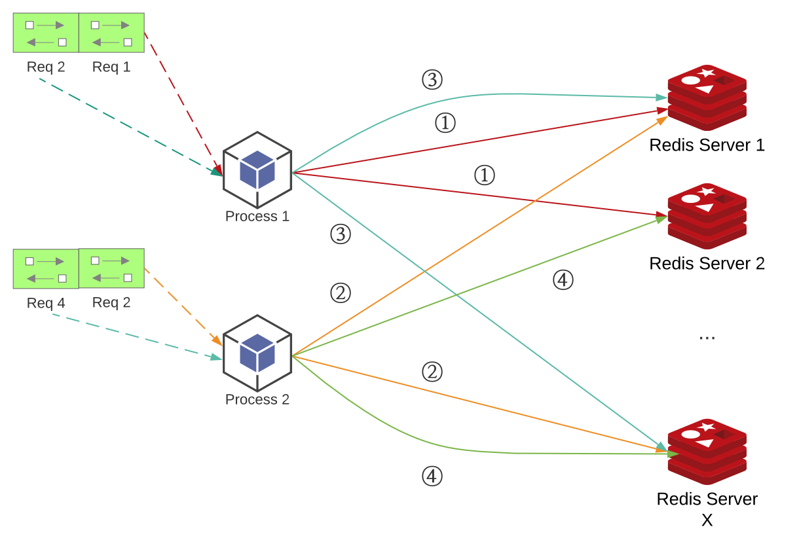
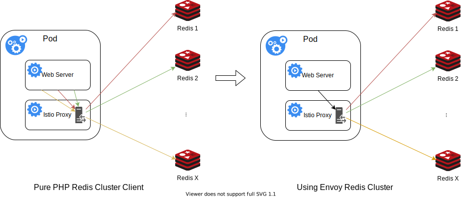

# How do we use Envoy to improve PHP Redis client performance


Redis plays a very important role in Houzz's technical stack - we used it for as  key-value storage, caching layer, queue system, etc. 

Redis uses standard TCP protocol for clients to connect to it, to connect to a single Redis instance, the client just need to establish a TCP connection with Redis server, and send raw command using text. You could easily test a connection to Redis server using `telnet` command.

```
bash-3.2$ telnet 127.0.0.1 6379
Trying 127.0.0.1...
Connected to 127.0.0.1.
Escape character is '^]'.
PING
+PONG
```

## Redis Cluster

As many other storage systems, Redis also has distributed mode -  it is called Redis cluster. The way how Redis scales from 1 instances to muiltiple instances is relying on the KEY hashing. As a key value storage system, Redis cluster will try to distributed all KEYs into different instances based on the CRC hash of the KEY. Each instance in the Redis cluster only stores KEYs within its own slots ranges, and all instances in the Redis custer will cover the whole range of CRC hash which is [0, 16384].

Redis also support primary / secondary mode which could provides data redudancy and seperate read/update opertions. Each slot range can have 1 primary instance, with 1 or more replica instances storing the same KEYs. 
 



The operations on single Redis instance varies from it on Redis cluster. To use single Redis instance, we just connect to the single socket address, to use a Redis cluster, we would need to have more complicated logic. Typically, a Redis cluster client need to support the following features:

1. Automatically discover cluster topology. Since KEYs are stored in different Redis server instances, the Redis cluster client has to know which slot range is stored in which Redis server instances (including primary / replicas). Redis cluster provides a `CLUSTER SLOTS` command that can return the server topology with arrays of slot range and primary/replica socket addresses. To execute the `CLUSTER SLOTS` command, the Redis cluster client need to know at least the address of 1 nodes in the Redis cluster topology, which is usually passed in as start probe address(es) when inititalizing the client instance.
2. On demand dispatch commands to Redis server instance. When using Redis cluster client to send a command that carries KEY(s) parameter to the Redis cluster, the client has to determine which Redis server instance(s) should the command to sent to. How to detemine them is based on the server topology fetcher in previous step, to calculate the CRC hash of the KEY(s), then find the slot range that the KEY resides, and then based on the read / write policy, to send the command to the primary / replica Redis server instance of the slot range that the KEY belongs to. For some commands operating multiple KEYs (e.g. mget, mset, etc), the client has to split the single multiple key command into several batches based on the slot range group of the KEYs, and send the command with each group's KEYs to the corresponding Redis server instance, and merge the results from all instances. Some client libraries didn't implement this "advanced" feature, therefore they declare they don't support multi-key commands with keys across slots.

There are already a lot of [Redis client libraries](https://redis.io/clients) developed in different languages that could help to mitigate the difference of connecting to a single Redis client or Redis cluster.  In most of the senarios, programmers won't notice the difference of using single Redis instance or Redis cluster, since the complexity is capsulated by the client libraries. 

## PHP Redis Cluster Client and the Problem

A single Redis instance can satisfy the small use cases, at the scale of supporting Houzz's business, we have to Redis cluster vs single Redis instance since we've stored TBs data in Redis and it has to be distributed into different instances. 

As the time of 2021, we've setup a Redis cluster with 200+ instances, with primary / replica enabled, to make sure we have data redundancy and ability to recover from single instance failure.

As historical reasons, Houzz's major programming language is PHP, it is still one of the most popular programming language in web development. And we use [predis](https://github.com/predis/predis), a widely used PHP Redis client that supports Redis cluster, it provides the feature such as automatic cluster topology discovery and on demand dispatch commands to Redis server instance. 

Funtionality wise, we are satisified with the PHP redis client, however, the nature of PHP language itself gives us very big challange on the performance side.

Unlike Java, Python or Node server applications, PHP process does not share data between subsequent requests. Once PHP handles a web request, it will discard all the data before it's ready to handle the next request. 

Why does this hurt the performance of the Redis cluster client?

First of all, the cluster topology will not be shared across requests. Suppose predis first connect to one of the start probe redis server instance, send `CLUSTER SLOTS` command, and got the cluster topology in the handling of one request, the topology, which is usually a nested `array` in memory will not be used in the next request. Therefore, in the next request, predis has to connect to one of the start probe again, and send `CLUSTER SLOTS` again to get the cluster topology. This is exremely ineffective since Redis cluster topology rarely changes (usually it only changes when we take some redis nodes down or add new redis nodes, which will cause a rebalance). The extra `CLUSTER SLOTS` command usually add up 4 ~ 5 ms to the redis access time per request, if in the request, there are only 1 redis operation needed, then we added 100% overhead than it's supposed to be. 

Another nature behavior of PHP process is that, you can not persist any TCP connections between two requests. 



As described in the above graph, suppose we have 2 PHP processes running on a single machine, with 2 requests been handled per process, and each request will need to connect to 2 Redis server instances. The subsequantial requests handled by the same process will connect to the same redis server instance, yet since the previous request's TCP connection is closed, it can not be reused, so even it connects to the same socket address (of the Redis server instance), it has to create another TCP connection.

So as a PHP process is handling more and more requests, it creates / closes more and more TCP connections to Redis clusters. Compared to other languages which could maintain persistent TCP connections in the process, this is already a big performance loss.

Another more critical problem is, a TCP connection's termination is not a direct close and not releasing the resource immediately.


As described in the above graph, in active close mode, when the TCP connection initiator (in this case the PHP redis cluster client) started to close the the connection, it sends a `FIN` packet through the TCP connection, the TCP connectino receiver (Redis cluster instance) will need to send `ACK` + `FIN` packet back. Due to the nature of TCP connection, initiator will turn into `TIME_WAIT` status until finally it timeout and connection is finally closed, the TCP connection resource is recycled by system.

Due to the PHP Redis cluster client access pattern, it keeps creating new TCP connections to PHP Redis cluster instances and closes them immediately after 1 session ends. Due to the QPS of our production traffic volume to 1 box, it leaves too many  `TIME_WAIT` TCP connections in the box. Once `TIME_WAIT` TCP connections pile up, new TCP connections are slower to be created, thus making Redis cluster client to be slower, and causing web request responding time to increase, more requests are stucking. In the end, it reaches the threshold that Redis cluster client failed to create TCP connections within the timeout settings time (4s), and it will throw an error saying Redis server is down.

We noticed this issue from last year when our access volume significant increased (from business perspective it's a very good sign!), and we were seeing more errors complaining about Redis server down and performance degradation during the peek hours.  But Redis servers actually are not on high pressure at all, the bottleneck is purely from the TCP connections from the client side. While to solve this, every time SRE team has to increase the instances of our application boxes, which is unnessasary, and a waste of our computing resources.

## Finding Solutions

If you google/stackoverflow "too many TIME_WAIT tcp connections" keywords, some of the blogs will lead to the following solution: Enable tcp resuse feature to reduce the `TIME_WAIT` TCP connections. 

```
sysctl -w net.ipv4.tcp_tw_reuse=1
```
We believed this would work, and added this option to the system default setting of our production boxes, however, it didn't help. The TCP connections in `TIME_WAIT` state are still high.

```
root@web-server:/# sysctl net.ipv4.tcp_tw_reuse=1
net.ipv4.tcp_tw_reuse = 1
root@web-server:/# ss -tan state time-wait | grep 6379 | wc -l
70145
```
Inspired by [Coping with the TCP TIME-WAIT state on busy Linux servers](https://vincent.bernat.ch/en/blog/2014-tcp-time-wait-state-linux#netipv4tcp_tw_reuse) blog post, we think we found the reason why it didn't work.

> By enabling net.ipv4.tcp\_tw\_reuse, Linux will reuse an existing connection in the TIME-WAIT state for a new outgoing connection if the new timestamp is strictly bigger than the most recent timestamp recorded for the previous connection: an outgoing connection in the TIME-WAIT state can be reused after just one second.

Within "Just one second", since the QPS of the box is around 100, it will probably create ~ 100 (avg QPS) * 50 (avg # of redis connections in 1 request) = 5,000 new TCP connections, and these 5K connections can not reuse the `TIME_WAIT` connections left intact in the exact second. Before it could benefit from the tcp reuse mechanism, the too many `TIME_WAIT` TCP connections hold up the kernal from creating new TCP connections, thus this didn't help much.

## Envoy / Envoy Redis Cluster

Since the year of 2020, we introduced Istio as our service mesh solution to our Kubernetes cluster, and it started to play as the proxy for all network traffic from / to our web application container.

Envoy, as the proxy implementation of Istio, provides a lot of features that helps the abstract the networking logic from application code.

One inspiring feature that Envoy provides in the newer versions, which is the final solution we used for solving this issue, is [Redis Cluster support](https://www.envoyproxy.io/docs/envoy/latest/intro/arch_overview/other_protocols/redis#redis-cluster-support-experimental).

> When using Envoy as a sidecar proxy for a Redis Cluster, the service can use a non-cluster Redis client implemented in any language to connect to the proxy as if it’s a single node Redis instance. The Envoy proxy will keep track of the cluster topology and send commands to the correct Redis node in the cluster according to the spec. Advance features such as reading from replicas can also be added to the Envoy proxy instead of updating redis clients in each language.
> 
> Envoy proxy tracks the topology of the cluster by sending periodic cluster slots commands to a random node in the cluster, and maintains the following information:
> 
> * List of known nodes.
> * The primaries for each shard.
> * Nodes entering or leaving the cluster.

With this feature enabled, mthe PHP Redis client's cluster related logic will be taken over by Envoy. PHP Redis client only need to create one connection to the proxied Redis instance provided by Envoy.

It took us for a while to figure out how exactly to configure the Envoy Redis cluster proxy, due to the lack of examples provided. But we finally figured out the configuration, first of all, we need to create a backend cluster.

```yaml
apiVersion: networking.istio.io/v1alpha3
kind: EnvoyFilter
metadata:
  name: redis-cluster-backend
spec:
  configPatches:
  - applyTo: CLUSTER
    patch:
      operation: INSERT_FIRST
      value:
        cluster_type:
          name: envoy.clusters.redis
          typed_config:
            '@type': type.googleapis.com/google.protobuf.Struct
            value:
              cluster_refresh_rate: 1800s
              cluster_refresh_timeout: 4s
              host_degraded_refresh_threshold: 1
              redirect_refresh_interval: 4s
              redirect_refresh_threshold: 1
        connect_timeout: 4s
        dns_lookup_family: V4_ONLY
        load_assignment:
          cluster_name: custom-redis-cluster
          endpoints:
          - lb_endpoints:
            - endpoint:
                address:
                  socket_address:
                    address: <redis instance 1 ip>
                    port_value: <redis instance 1 port>
            - endpoint:
                address:
                  socket_address:
                    address: <redis instance 2 ip>
                    port_value: <redis instance 1 port>
            - endpoint:
                address:
                  socket_address:
                    address: <redis instance 3 port>
                    port_value: <redis instance 3 port>
        name: redis-cluster-backend
        outlier_detection:
          base_ejection_time: 20s
          consecutive_5xx: 1
          interval: 5s
        upstream_connection_options:
          tcp_keepalive:
            keepalive_interval: 5
            keepalive_probes: 1
            keepalive_time: 30
```

In the backend settings, the most important settings is the `load_assignment`, it basically describes the startuo probe nodes that envoy will send `CLUSTER SLOTS` command to get the cluster topology.

There are definitely quite a few settings worth being tuned to get better performance:

1. **cluster\_refresh\_rate**:  This is the interval between `CLUSTER SLOTS` commands sent from envoy to startup probe nodes. Typically redis cluster topology won't change that frequently, so we could set this value much longer than default value (5s)
2. **host\_degraded\_refresh\_threshold**: The number of hosts became degraded or unhealthy before triggering a topology refresh request. This is very helpful, since we will configure `cluster_refresh_rate` to be as long as possible, once the redis cluster topology changed between two refresh, this config setting to a low value (1 for most aggresive) will immediately let Envoy to send `CLUSTER SLOS` command to get the new topology, to remove potential problematic node out of the connection pools.
3. **redirect\_refresh\_threshold**: The number of redirection errors that must be received before triggering a topology refresh request. Sometimes, when we add / remove nodes from Redis cluster, the key will rebalance among the new cluster instances, it will cause some response to be `MOVED` or `ASK`, in this case, we should let Envoy to send `CLUSTER SLOS` command to get the new topology immeidately.
4. **outlier\_detection**: [Outlie detection](https://www.envoyproxy.io/docs/envoy/latest/intro/arch_overview/upstream/outlier) is unified mechanism in Envoy to detect outlited upstream hosts. In Envoy Redis cluster, an upstream means 1 redis cluster server in the topology. Suppose a redis cluster node was suddenly down, the following request to the node will get ERR response. The `consecutive_5xx` setting is the threshold of ERR responses in past `interval` time so as to consider the node to be unhealthy. Once the node is considered unhealthy, it will be taken out of the upstream servers, and will tried to be put back after `base_ejection_time`, and exponentially backoff in following degradations.
5. **upstream\_connection\_options**: This is mostly for tuning the keep alive setting for TCP connections between Envoy and Redis cluster nodes. Envoy will on demandly connect to Redis cluster nodes if PHP client tries to send a command to the destination nodes, after the command is sent, the connection remains `ESTABLISED` state. But if the connnection stays too long time without sending any packages to Redis cluster node, it might be closed by the Redis cluster node, in order to extend the life of the TCP connection, we could configure Envoy sending keepalive packet to Redis cluster node after `keepalive_time` since the connection is established, and set it to send `keepalive_probes` times keepalive interval with `keep_alive` interval. 
 

We also need to create a frontend in Envoy to let the PHP client in main container to connect. 

```yaml
apiVersion: networking.istio.io/v1alpha3
kind: EnvoyFilter
metadata:
  name: redis-cluster-frontend
spec:
  configPatches:
  - applyTo: LISTENER
    match:
      context: SIDECAR_OUTBOUND
    patch:
      operation: ADD
      value:
        address:
          socket_address:
            address: 127.0.10.1
            port_value: 6379
            protocol: TCP
        filter_chains:
        - filters:
          - name: envoy.filters.network.redis_proxy
            typed_config:
              '@type': type.googleapis.com/envoy.extensions.filters.network.redis_proxy.v3.RedisProxy
              prefix_routes:
                catch_all_route:
                  cluster: redis-cluster-backend
              settings:
                enable_hashtagging: true
                enable_redirection: true
                op_timeout: 4s
                read_policy: PREFER_REPLICA
              stat_prefix: redis_proxy
        name: redis-cluster-frontend
```

The above configuraion creates a Redis proxy frontend on `127.0.10.1:6379`. This address is available to the other containers aside from istio-proxy. The most importan config, is `prefix_routes.catch_all_route` to `redis-cluster-backend` cluster which is the exact backend cluster we created before. The config of proxy frontend is relatively simple, with fewer settings could be tuned, one important setting is `read_policy`, we chose `PREFER_REPLICA` to achive the functional parity as the original PHP Redis cluster client's logic - when reading from redis (get, mget, etc), always try to read from replica nodes, only read from primary nodes when all replica nodes for the slots were not available.




The above graph directly shows the magic why using Envoy Redis cluster proxy could save TCP connections.

Before, suppose in 1 request handling process PHP Redis client needs to connect to X Redis cluster instaces, it has to create X TCP connections from main web server container to istio-proxy container, and envoy has to create corresponding X TCP connections from istio-proxy container to Redis cluster instances.

After using the Envoy Redis cluster proxy, PHP client only needs to connect to the frontend proxy in istio-proxy container, and Envoy will "smartly" dispatch the commands to proxy backend, and create connections to X Redis cluster servers.

We saved X - 1 TCP connections for one request handled by the PHP process. What's more, the X connections created between Envoy Redis cluster proxy backend and the real Redis cluster services are persistent connections, they do not close after the PHP process finished handling 1 request. Also, other requests handled by other PHP processes in the main web server container could also reuse the connections since the frontend and backend is seperated. These all leads to a huge save of TCP connections.

```
root@web-server:/# ss -tan state time-wait | grep 6379 | wc -l
3108
```

By doing this, we broke the nature limitation of PHP language, we reduced `TIME_WAIT` tcp connections by 95%!

Also, we see great reduce of average redis connection time per request dropped from ~5ms to nearly 0ms! This is contributed by:

1. Much fewer connections needs to be made since all commands are sent to to the same frontend proxy by PHP client, thus only 1 connection needs to be created per requet.
2. Connection to the frontend is via local network (from main container to istio-proxy container), which is much stable and lightweighted.


We roll out this solution 100% on our production k8s clusters, and indeed, it solved the bottleneck of `TIME_WAIT` TCP connections, and enabled our Pods to be able to take more traffic. It also leads to some save of the k8s resources. 

## Caveats

While we talked all good things about Envoy Redis cluster proxy, there are certainly some caveats for using it.

### Read / Write performance degradation
We mentioned the average TCP connection time reduced from ~ 5m to nearly 0ms in the last chapter. But for read / write redis operations, the performance degradated a bit. This is easy to understand. Envoy still needs to create the TCP connections to Redis cluster nodes, and it still needs to send the command packages to the nodes, and receive the responses, even more logic was added to dispatch commands to the correct node(s) and aggregate responses from multiple nodes (e.g. mget, mset). This degradation was more obvious for sparse request when the TCP connection reuse in the proxy backend wasn't giving much benefit.

We noticed this consistent performance degradation while we were finally OK with it - the overall average read / write time was fast enough comparing to rest of PHP code logic.

### Lack of retry logic

There was an very important feature in the old PHP Redis Cluster client, which is the auto retry logic. 

Generally for each shard of the Redis cluster, it consists of 1 primary node and 2 replica nodes. When PHP Redis cluster client is to send a read command, it first will pick a random replica to send the command, if the command failed due to network commnunication issue, it will retry to send the command to the other replica node, if it still fails, it will ultimately send the command to the primary node.

This logic is straightforward and is very helpful to mitigate the downtime. Suppose we are doing a rolling restart of the whole Redis cluster, typically we will restart 1 node at one time, the retry logic will make sure the request can still be properly handled.

 
Unfortunately, Built-in retry logic is still on the [planned future features list](https://www.envoyproxy.io/docs/envoy/latest/intro/arch_overview/other_protocols/redis) at the moment of Mid 2021, as we tested putting down 1 replica node in 1 shard, we noticed there were around 10 seconds downtime when we see client errors of "no upstream hosts" from Envoy. This down time could be mitigated by tuning the `outlier_detection` settings, when the node is down, subsequential requests to the specific node will be errored out, after the `outlier_detection.interval` time, it will be taken out of the upstreams and Envoy will stop sending any more commands to this node. 

Currently there is no good way to bypass this issue. Even we retry within the PHP client, the PHP client couldn't decide which Redis cluster node that Envoy will connect.

We lived with this lack of retry logic, and rely on the `outlier_detection` mechanism to mitigate the downtime, and we really hope the built-in retry logic could be supported soon.

### Too many ESTABLISHED connections

This is a problem we forsee, that before our PHP clients create TCP connections to Redis cluster nodes, and disconnect soon after the request is processed. The "come and go" pattern actually has a benefit that overall Redis cluster nodes do not have too many `ESTABLISHED` connections from the clients.

Ever since we start testing using Envoy Redis cluster proxy, we immediately noticed dramatic increase of `ESTABLISHED` connections from the Redis server nodes. The increased persistent connections have been impacted the connection performance - if 1 Redis cluster node has been connected by too many clients, newer connections will be hard to made.

To improve this, we tuned down `timeout` setting in redis.conf on the Redis server side from 300 seconds to half of the value, and it helped to reduce 30% of the `ESTABLISHED` connections in our workload. The `timeout` setting let Redis server side to close the connection after a client is idle for that long time. However, there is always the trade off - The shorter we configured the `timeout` setting, the more likely Envoy will have to connect more frequently to Redis cluster nodes, and impact the overall Redis client performance.


Another solution, is to increase the Redis cluster nodes number, so average connections to 1 Redis cluster nodes will drop, however, this will cause unessasary resource waste if Redis workload is not high on each node.

