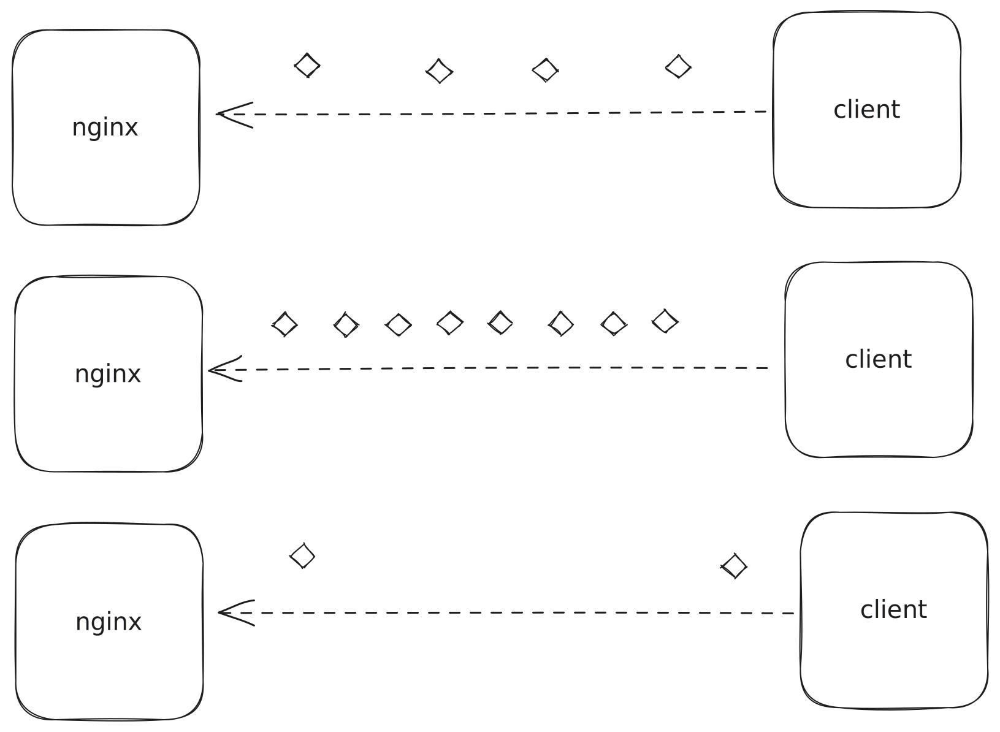
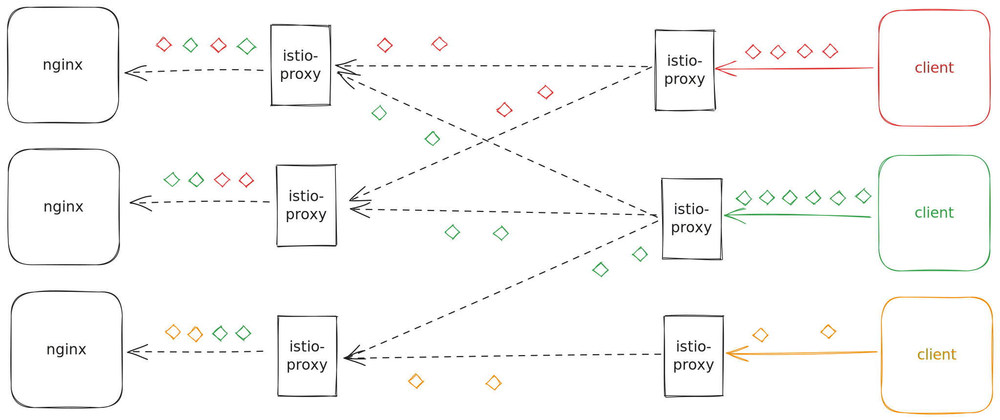
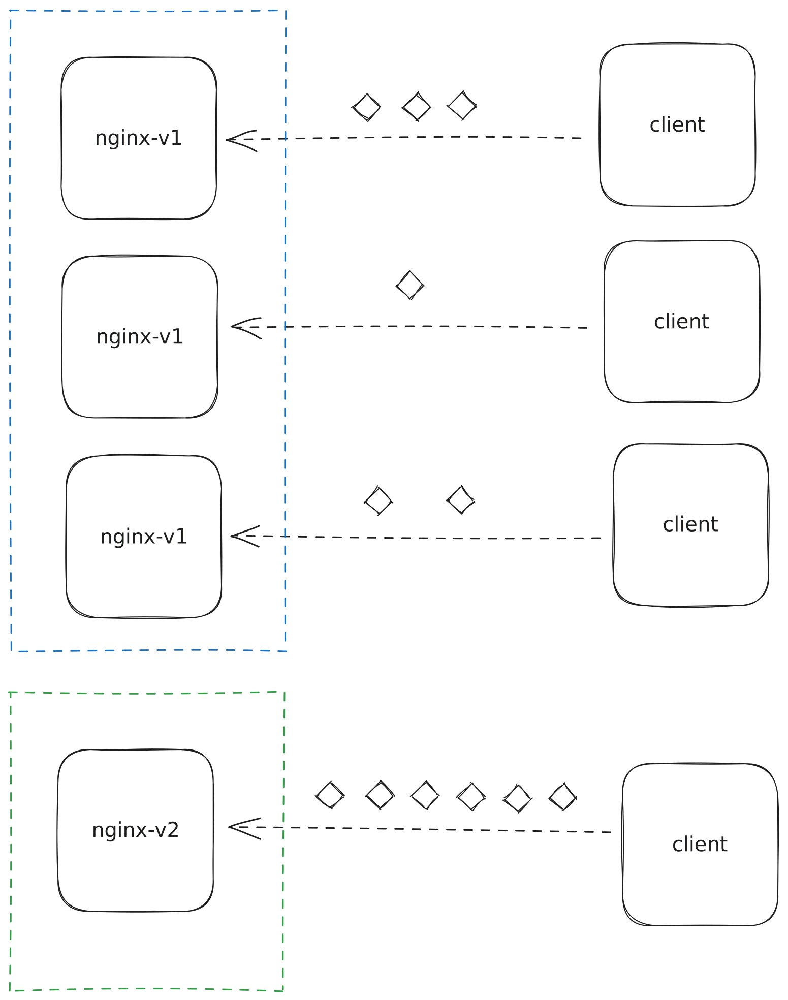
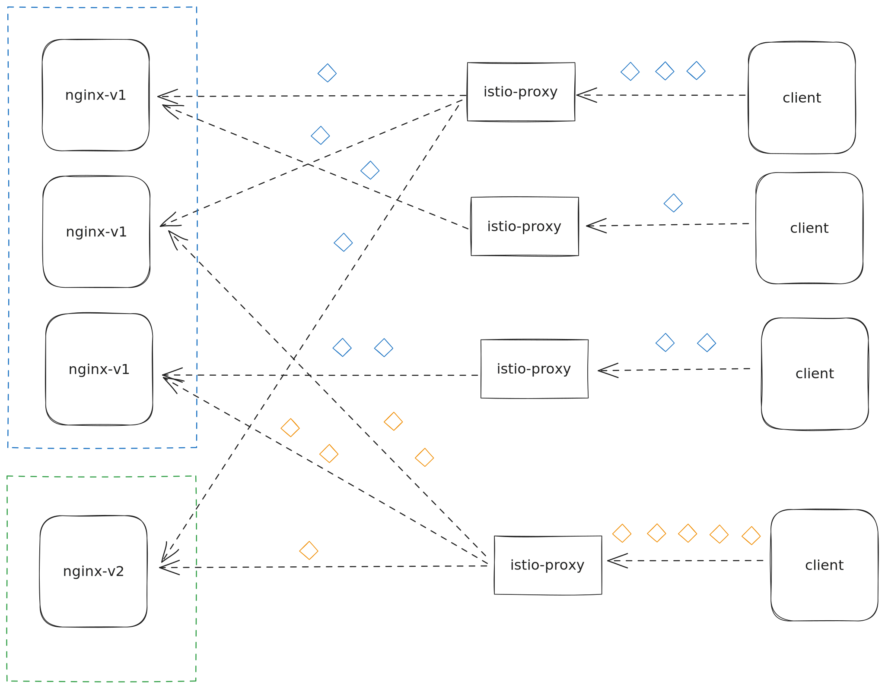

# L4 vs L7

As many of the students who have studied computer science, networking is definitely a part that is very important, but easy to forget after graduation.

All the modern frameworks in different languages hide the details of networking from you, and you can use just 3 lines to make a HTTP call in Python.

```python
import requests
r = requests.get(url)
print(r.text)
```

You take for granted that this is the ability provided, and may never remember those terminologies like physical layer, TCP handshake, etc. (Unless one day you were asked the question [What happens when you type google.com in your browser and press Enter](https://www.linkedin.com/pulse/what-happens-when-you-type-googlecom-your-browser-press-sule-bala/))

We are not going to cover that many details about networking in this article. But there is a key quesition that we should be able to answer, why do we introduce Istio for the first place?

Stories may vary for different organization, but I guess the main purpose of introducing Istio should have **better** traffic management in Kubernetes. The word "better" was emphasized because it's not that kubernetes can not do traffic management. Kubernetes does provide traffic management, and in most senarios it works fine so that you do not need a better solution.


What exactly is Traffic Management in Kubernetes? Simply speaking, to control how requests will be routed to Pods. 

Let's take a look at a simple example. We first create a kubernetes deployment of nginx,

```yaml
apiVersion: apps/v1
kind: Deployment
metadata:
  name: nginx-deployment
spec:
  replicas: 3
  selector:
    matchLabels:
      app: nginx
  template:
    metadata:
      labels:
        app: nginx
    spec:
      containers:
      - name: nginx
        image: nginx:latest
```
and create corresponding service for accessing the nginx http server.

```yaml
apiVersion: v1
kind: Service
metadata:
  name: nginx-service
spec:
  selector:
    app: nginx
  ports:
    - protocol: TCP
      port: 80
      targetPort: 80
  type: ClusterIP
```

Three `nginx-deployment` pods will be created, and you try to test the nginx service by typing `curl http://nginx-service.namepace.svc.cluster.local` in any pod on the same kubernetes cluster. It would output "It Works!" as the default nginx response.

## Traffic Management - Load balancing

How did the `curl` commmand reached the `nginx-deployment` pods? The `curl` command uses HTTP protocol, and it needs to establish a TCP connection to `nginx-service.namepace.svc.cluster.local` with `80` port. Since there are three `nginx` Pods, how does kubernetes decide which Pod's nginx to connect? 


Let's see how it is working without Istio.  As the native kubernetes service implementation, `kube-proxy` is responsible for the decision. Once `nginx-service` is created, `kube-proxy` takes care of following things:

1. It creates IP address for the `nginx-service` and persist the record to kube-dns / core-dns, so when curl tries to resolve `nginx-service.namepace.svc.cluster.local` it will get an dedicated Service IP.
2. Whenever a `nginx` Pod is created / deleted, become ready / unready, `kube-proxy` needs to add / remove the Pod from / to available candidates for `nginx-service`.
3. Whenever a TCP connection is to be established to the service IP / port, `kube-proxy` needs to select one candidate from its internal maintained list.

This is so-called "Load Balancing". The load balancing strategy may varies in different kubernetes versions, in high level it will do sort of "round robin" to let each of the Pod to be able to receive connections with even possibility (at best effort).

### L4 layer load balancing - kube-proxy

The above process generally works well for most of the senarios. If you get 30 QPS requests to the `nginx-service`, theoritically it should have ~ 10 QPS requests to each of the `nginx-deployment` Pod.

But in reality, you may find QPS is not evenly distributed in the 3 `nginx-deployment` Pod, in some extreme cases, 1 Pod may get 30 QPS requests while other 2 Pods don't get traffic at all.

How does it happen? 

HTTP Protocol relies on TCP connections, so 1 HTTP request means we need to have 1 TCP connection. But it's not like every HTTP request has to create a new TCP connection. There is this "Keep Alive" mechanism that a client can establish 1 TCP connection and reuse it for multiple HTTP requests.


     
  
The above graph can directly simulate the actual traffic from different clients to different nginx pods. Although the TCP connections are evenly distributed, but actual HTTP requests are not.

This is exactly the bottleneck of kubernete's native traffic management - it only works at **L4 (Transport) Layer**, while HTTP protocol is at **L7 (Application) Layer**. Once TCP connections are established, kubernetes lose the control how the client will use the connection, such as protocol, frequency, etc.

### L7 layer load balancing - Istio

How things would be different if we adapt Istio?

If we adapted istio and enabled the proxy injection in both service and client pods, we will see that `istio-proxy` container will be injected into the pods. Every single TCP connections from and to the pod will be intercepted.

As described in [Istio VS Envoy](02-Istio-Vs-Envoy.md), `envoy` does the the real job to establish the TCP connections to both side.

Essentially `envoy` needs to do the same job as `kube-proxy`, but it does not rely on `kube-proxy`, instead it implemented its ownd mechanism to do the service dns resolve, maintain the active candidates of Pods, and do the choice of pod for TCP connection.

But `envoy` does a bit more than that, `envoy` maintains the TCP connections to both sides, not not nessasarily a 1:1 mapping.

Look at the following graph as the example, client app tries to connect to `nginx-service.namepace.svc.cluster.local`, and `envoy` in `istio-proxy` established the TCP connection between itself and the client process. But on the other hand, `envoy` would create (or reuse) 1 or more TCP connections between itself and `nginx-deployment` Pods.


     
Later on, when clint process tries to send GET http requests, `istio-proxy` would use some strategy to forward the requests to differnt TCP connections with `nginx-deployment` Pods. As a result, even the client pods may request at different frequency, ideally we could still achieve average QPS load in each of the `nginx-deployment` Pods.


This is so-called the **L7 (Application) Layer** load balancing, and this is the ability we would want from the Istio service mesh solution. 

Not all of types the requests can benefit from the traffic management. For example, if you have a service app serves as TCP server and use custom Protocol, istio can not do that much to help with the load balancing. HTTP Protocol can be managed in this way because it's a "stateless" protocol, so `istio-proxy` can route the requests from the same client to different destination. 

### Load balancing tuning with Istio

Once we realized that istio has the ability to manage traffic in L7 layer, we probably wanted to tune it to satisfy our application's characteristics. 

[DestinationRule](https://istio.io/latest/docs/reference/config/networking/destination-rule/) is the key setting to tune traffic loadbalancing in L7 layer. It offers varities of configurations for users from simple strategies to advanced ones.

#### Simple load balancing
Most of the users would be satisified [standard load balancing algorithms](https://istio.io/latest/docs/reference/config/networking/destination-rule/#LoadBalancerSettings-SimpleLB) provided by Istio, that require no tuning.

```yaml
apiVersion: networking.istio.io/v1alpha3
kind: DestinationRule
metadata:
  name: nginx-service-dr
spec:
  host: nginx-service.namespace.svc.cluster.local
  trafficPolicy:
    loadBalancer:
      simple: ROUND_ROBIN
```

`LEAST_REQUEST` and `ROUND_ROBIN` would be the most practical algorithms that you might want to adapt to make the requests evenly distributed in your workloads. 99% of the time it is enough to do so.


#### Consistent hash load balancing

Sometimes, you may want the traffic with the same characteristics to go to the same Pod for some reasons. For example, you may have in memory cache that may speed up the subsequential requests from the same user, or you may support resume from break-point for the same file uploads, etc. 

To satisfy the the requirement of traffic "stickness", istio offers `consistentHash` strategy to let you to configure to use some of the traffic's information - header, cookie, ip, etc. as the source for calculating hash, any traffic hashed to the same bucket would go to the same destination pod. Following is a simple example to use a specific header for consistent hash.

```yaml
apiVersion: networking.istio.io/v1alpha3
kind: DestinationRule
metadata:
  name: nginx-service-dr
spec:
  host: nginx-service.namespace.svc.cluster.local
  trafficPolicy:
    loadBalancer:
      consistentHash:
        httpHeaderName: "my-header"
```
Notice that: 1. `consistentHash` is only best effort, it will be impacted by pods scale up / down. 2. After applying this strategy, you may experience traffic imbalance due to the nature of user traffic distribution. More settings can be referenced in [the official documentation](https://istio.io/latest/docs/reference/config/networking/destination-rule/#LoadBalancerSettings-ConsistentHashLB)

### Traffic Management - Routing

After checking out the above settings, you might be pretty amazed by Istio already. But these are not enough to make Istio a good service mesh solution.

One senario we leverage Istio for advanced traffic management is for release management.

To extend then nginx example in previous sections, now suppose we already have a `nginx-deployment` deployment that is using nginx:3.24, and we would like to upgrade it to use nginx:3.25. How would you approach it?

The simpliest way is to just editing the original deployment's pod spec, and switch the image from `nginx:3.24` to `nginx:3.25`, once you've done the operation, kuernetes will automatically trigger a rollout restart of the `nginx-deployment`, and old pods with 3.24 version will be terminated, and new pods with 3.25 version will be created.

This works for some non-essential applications which you are either very confident to do a direct rollout or you are tolerant to temporary service down time so that you can easily rollback by switch the image version back.

Sometimes your application is essential, and you definitely do want to do a phase rollout - you may want to test new version first with a small portion of traffic, and ramp up the traffic to new version higher, and eventually 100% to the new version if everything is good; Otherwise, you might want to ramp down the traffic to 0% to the new version, and 100% to the old version.

It is possible to achieve this without service mesh solutions, but not perfectly. Let's say we could always create multiple deployments of our applications with different versions.

For example, we create a `nginx-deployment-v1` deployment with `nginx:3.24` image.

```yaml
apiVersion: apps/v1
kind: Deployment
metadata:
  name: nginx-deployment-v1
spec:
  replicas: 3
  selector:
    matchLabels:
      app: nginx   
      version: 1  
  template:
    metadata:
      labels:
        app: nginx
        version: 1
    spec:
      containers:
      - name: nginx
        image: nginx:3.24
```
And we create another deployment `nginx-deployment-v2` with `nginx:3.25` image.

```yaml
apiVersion: apps/v1
kind: Deployment
metadata:
  name: nginx-deployment-v2
spec:
  replicas: 0
  selector:
    matchLabels:
      app: nginx
      version: 2
  template:
    metadata:
      labels:
        app: nginx
        version: 2
    spec:
      containers:
      - name: nginx
        image: nginx:3.25
```

The two deployments have the same label `app: nginx-service`, so the `nginx-service` Service will recogonize both deployment's apps. 

We first will let `nginx-deployment-v2` to have 0 replicas, therefore TCP connections to `nginx-service.namepace.svc.cluster.local` are all with `nginx-deployment-v1` Pods. As we want to ramp up new version traffic, we could increase `nginx-deployment-v2` Pod replicas to 1, therefore there will be 3 `nginx-deployment-v1` pods and 1 `nginx-deployment-v2`, with the native kubernetes service load balancing, there is 25% possibility client Pods connecting to v2 pod and 75% possibility connecting to v1 pods. We could keep increaseing v2 pods replicas and reduce v2 pods replicas, until finally v1 pods scale down to 0, all traffic will go to v2 pods. If we find problems with v2 pods, we can revert the operation.



     
This process is just fine for normal release requrement, which you will have sort of the live / canary mechanism to test the new rollout. But this is not perfect because the granularity of the ramp up / down can not be precisely controlled. 

First of all, we have 3 replicas of old pods, so even ramping up 1 new pod will cause ~25% connections connecting to the new Pod.

Secondly, due to the L4 layer load balancing limitation, even if we setup old / new pods to be 3 : 1, the actual HTTP request % may diverge due to some clients calling more / less frequently.

How could Istio manage the routing better?

Istio would allow we define different "subsets" of a service by adding name with label selectors in `DestinationRule` - Remember we used this resource in above sections for load balancing? It can also be used for categorizing the service pods.

```yaml
apiVersion: networking.istio.io/v1alpha3
kind: DestinationRule
metadata:
  name: nginx-service-dr
spec:
  host: nginx-service.namespace.svc.cluster.local
  subsets:
    - name: v1
      labels:
        version: 1
    - name: v2
      labels:
        version: 2
```

The above config setup 2 subsets of nginx-service, the `v1` subset containing nginx:3.24, and `v2` subset containing nginx:3.25.

After setting up DestinationRule, we setup a `VirtualService` resource to define the route behavior.

```yaml
apiVersion: networking.istio.io/v1alpha3
kind: VirtualService
metadata:
  name: nginx-service-vs
spec:
  host: nginx-service.namespace.svc.cluster.local
  http:
    - route:
      - destination:
          host: nginx-service
          subset: v1
        weight: 99
    - route:
      - destination:
          host: nginx-service
          subset: v2
        weight: 1
```
We defined `http.route` config in VirtualService and let 99% of the http requests goes to `v1` subset, and 1% of the traffic goes to `v2` subset.


     
The client app's `istio-proxy` will based on the `VirtualService` setting, to control the traffic split behavior. For example, if a client app sends 100 requests, 99 requests would go to v1 pods, 1 request would go to v2 pods. So even we have 3 v1 pods, and 1 v2 pods, we could still achieve 1% traffic split safely.

### Advanced traffic route rules

We see how the combination of VirtualService and DestinationRule controls the traffic split to v1 / v2 nginx nicely, but this is not the only ability of it.

Sometimes you want to test certain endpoints with specfic subsets - for example you want a certain URL pattern goes to some pods.

It's very straightforward in `VirtualService` config that you can add `match` rules in `http.route`.


```yaml
apiVersion: networking.istio.io/v1alpha3
kind: VirtualService
metadata:
  name: nginx-service-vs
spec:
  host: nginx-service.namespace.svc.cluster.local
  http:
    - match:
      - uri:
        prefix: "/v2"
      route:
        destination:
          host: nginx-service
          subset: v2
    - route:
      - destination:
          host: nginx-service
          subset: v1
```

The above config would make it possible that:

1. `curl http://nginx-service.namespace.svc.cluster.local/v2` goes to v2 pods
2. Other requests goes to v1 pods


Another common senario is that, you have a public facing web service, and before rolling out the new version, you want test the new versions on your browser using same urls, but "normal" users still access the old version.

A simple way to let Istio to identify "test" traffic would be adding a `debug=` cookie, and the requests with the cookie set would go to the new version.

```yaml
apiVersion: networking.istio.io/v1alpha3
kind: VirtualService
metadata:
  name: nginx-service-vs
spec:
  host: nginx-service.namespace.svc.cluster.local
  http:
    - match:
      - headers:
          cookie:
            regex: ^(.*?;)?\s*(debug=1)\s*(;.*)?$
      route:
        destination:
          host: nginx-service
          subset: v2
    - route:
      - destination:
          host: nginx-service
```
The setup is still using `match` rules, but instead of depending on `uri` matching, to use `headers` for matching. Cookie is 1 of the special header in HTTP protocol so it could be used. 

A few more interesting rules can be found in [official documentation](https://istio.io/latest/docs/reference/config/networking/virtual-service/#HTTPMatchRequest).


## Traffic Management - more to explore

By reading until here, I hope you've realized that why Istio is a **better** solution for traffic management - Its implementing L7 (Application) layer proxy is the key magic. Traffic management on the L4 (Transportation) layer have very limited flexibilities because it doesn't have the higher layer's information (Request, URL, Cookie, etc)

In this artical, we've checked a few example of Istio doing traffice management around load balancing and routing, but there are more things we could tweak with Istio, like retries, outlier detection, etc. We will touch these points in following articles.

